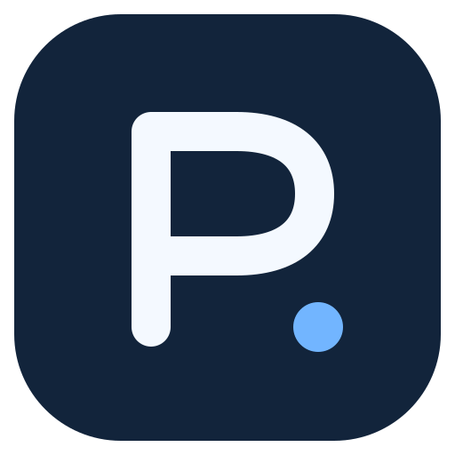
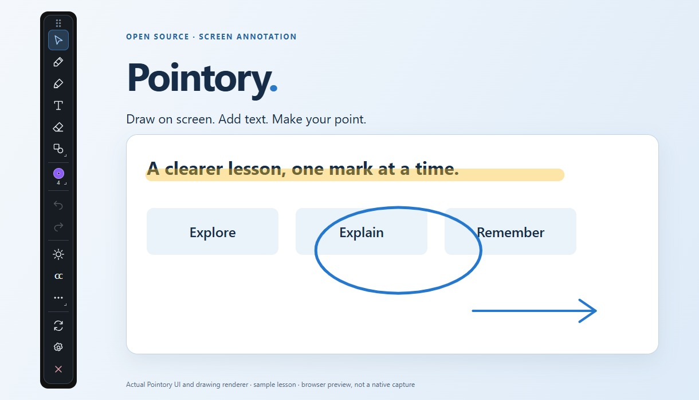

<p align="center"></p>

# Pointory — Open-source screen annotation & live captions

**Draw on your screen. Add text. Keep teaching, presenting, or working.**

Pointory is a free, MIT-licensed desktop screen annotation tool for teachers, presenters, and developers. Write over a selected monitor with a pen, highlighter, shapes, and typed text. Switch back to clicking your apps without clearing the ink. Optional live captions are available as an experimental feature.

[한국어](README.ko.md) · **[Download for Windows](https://github.com/BAEM1N/pointory/releases/latest)** · [User guides](Wiki/README.md) · [Report a bug](https://github.com/BAEM1N/pointory/issues/new?template=bug_report.md) · [Contribute](CONTRIBUTING.md)

[](LICENSE)
[](https://github.com/BAEM1N/pointory/releases/latest)
[](https://github.com/BAEM1N/pointory/actions/workflows/check.yml)
[](https://github.com/BAEM1N/pointory/stargazers)



*Actual Pointory UI and drawing renderer, captured in browser preview with sample content. This is not a native screen-sharing test. The previous MP4 demo is withdrawn while its replacement is redesigned.*

## Download

| Platform | Download | Status |
| --- | --- | --- |
| Windows x64 | [Installer EXE](https://github.com/BAEM1N/pointory/releases/download/v0.1.0/Pointory_0.1.0_x64-setup.exe) | v0.1.0 beta |
| Windows x64 | [Portable ZIP](https://github.com/BAEM1N/pointory/releases/download/v0.1.0/Pointory-0.1.0-windows-x64-portable.zip) | Extract, then run `Pointory.exe` |
| macOS | No DMG published yet | Runtime and Apple Silicon validation planned for v0.2 |
| Linux | No binary published yet | X11 development target; Wayland is not supported |

[SHA-256 checksums](https://github.com/BAEM1N/pointory/releases/download/v0.1.0/SHA256SUMS.txt) · [Release notes](https://github.com/BAEM1N/pointory/releases/tag/v0.1.0)

Windows needs WebView2. The installer can obtain that runtime. Current builds are unsigned and have no automatic updater. Close an older Pointory instance before starting a new build. Python is **not required for drawing**; captions need [optional setup](Wiki/EN/07-live-captions.md).

## Start in one minute

1. Install Pointory, or extract the portable ZIP and open `Pointory.exe`.
2. Open the toolbar's **Settings** gear button and choose the monitor to annotate.
3. Click **Pen** and draw. Click the **T** icon to type at a point on screen.
4. Press **Ctrl+Shift+D** to switch between drawing and using the app underneath.
5. Save a **PNG** or **GIF** before quitting. Ink and replay history are not saved between sessions.

[Illustrated quick start →](Wiki/EN/01-quick-start.md)

## What can Pointory do?

| Feature | How it helps | Guide |
| --- | --- | --- |
| Pen, highlighter, shapes | Mark slides, explain a diagram, highlight a point | [Drawing](Wiki/EN/03-drawing.md) |
| Typed text + fonts | Click to type; choose an installed font or import a TTF | [Text and fonts](Wiki/EN/04-text-fonts.md) |
| Horizontal or vertical toolbar | Keep everyday tools visible; open shapes, colors, and more beside the toolbar | [Toolbar](Wiki/EN/02-toolbar.md) |
| Docked settings + five themes | Keep controls beside the toolbar and choose the app color | [Settings](Wiki/EN/02-toolbar.md) |
| Select, move, resize, undo | Adjust whole annotations without drawing them again | [Editing ink](Wiki/EN/03-drawing.md) |
| Frozen-region zoom | Magnify a detail and annotate it | [Zoom and boards](Wiki/EN/05-zoom-boards.md) |
| Whiteboard, blackboard, fading ink | Switch teaching surfaces or emphasize briefly | [Boards](Wiki/EN/05-zoom-boards.md) |
| PNG / GIF export | Save an annotated screen, transparent ink, or an ink replay | [Export](Wiki/EN/06-export.md) |
| Cursor spotlight + magnifier | Follow the pointer with a bright circle; Windows live magnification | [Spotlight](Wiki/EN/11-spotlight.md) |
| Classroom browser sharing | Selected-file downloads + opt-in live screen on the same LAN | [Sharing](Wiki/EN/10-classroom-sharing.md) |
| Experimental live captions | Choose an audio device and local or cloud transcription | [Captions](Wiki/EN/07-live-captions.md) |

Looking for an open-source screen annotation alternative to Epic Pen or ZoomIt? Pointory focuses on a selected-monitor overlay, typed annotations, configurable toolbars, and optional captions. It is an independent project, not affiliated with those products.

## Built for useful, inspectable software

- **Free and open source:** project-authored code is MIT licensed, including workplace use.
- **No account for core tools:** annotate and export without signing in.
- **Local-first drawing:** drawing does not need a cloud service. The app has no analytics integration.
- **Small web UI, native shell:** built with Tauri 2, Rust, and plain JavaScript.
- **Documented limits:** captions, Mac support, and screen-sharing compatibility are not presented as fully verified.

The core UI includes English, Korean, Japanese, and Simplified Chinese. Caption, classroom-sharing, and spotlight settings currently include bilingual Korean/English labels. Full step-by-step documentation is available in [English](Wiki/EN/README.md) and [한국어](Wiki/KR/README.md).

## FAQ

### Does Pointory draw over other applications?

Yes. It uses an overlay on one selected monitor. Ink stays at screen coordinates; it does not follow a document when you scroll or change slides. Mouse mode lets clicks reach the application underneath.

### Can I use it while teaching or sharing a screen?

That is the intended use. Share the **entire selected monitor** and confirm the result with a participant. Sharing only one application window may omit the overlay. Zoom, Teams, and Meet have not been verified end to end.

### Does it support local speech recognition and GPU or NPU acceleration?

Experimental captions can use local Whisper. Available CPU and supported CUDA / Intel OpenVINO GPU or NPU runtimes are detected. Availability depends on hardware, drivers, model, and installed dependencies. Apple GPU / Neural Engine support is not implemented and validated as a release capability. [Details](Wiki/EN/07-live-captions.md).

### Does it record my screen or save meeting audio?

GIF export replays **annotations over a still background**, not a screen video. Opt-in LAN live view captures and sends the selected monitor while enabled; it does not create a video file. Audio and captions are not automatically saved. Optional cloud captions send audio to the selected provider while running and can incur API charges. API keys are not persisted.

### Can students open Pointory in a browser?

Yes: start **Share materials** on the instructor PC, select files, and show students the local URL or QR code. Students on the same network can download files. Enable live view separately to broadcast the selected monitor, including ink and open windows, at up to 1280×720 and approximately 2 fps without audio. This is experimental HTTP LAN sharing; firewall and school Wi-Fi isolation can prevent access. Cross-device classroom testing remains pending. [Guide](Wiki/EN/10-classroom-sharing.md).

### Is macOS ready?

Not yet. A successful CI build is not a native usability test. No verified DMG is available. [v0.2 Mac checklist](docs/HANDOFF-MACBOOK.ko.md).

### What happened to OnPen and LayerPen?

The project is now **Pointory** (포인토리), with the repository at `BAEM1N/pointory`. The internal application identifier remains unchanged for upgrade compatibility. New captures default to `Pictures/Pointory`; legacy settings and imported fonts are migrated without deleting previous exports. See the [brand notes](docs/BRAND.md) for naming and domain status.

## Roadmap

| Milestone | Focus |
| --- | --- |
| v0.1 Windows beta | Annotation, fonts, horizontal/vertical toolbar, spotlight, experimental LAN sharing and captions |
| v0.2 Mac validation | Retina / multiple displays, permissions, input, audio, Apple Silicon evaluation |
| Distribution improvements | Signed releases, store feasibility, broader reproducible testing |

These are development priorities, not promised delivery dates. [Changelog](docs/CHANGELOG.md) · [Open issues](https://github.com/BAEM1N/pointory/issues)

## Build from source

Install Node.js 22+, npm, Rust stable, and the [Tauri prerequisites](https://v2.tauri.app/start/prerequisites/) for your OS. Windows requires MSVC C++ tools, Windows SDK, and WebView2.

```sh
git clone https://github.com/BAEM1N/pointory.git
cd pointory
npm ci
npm test
cargo test --locked --manifest-path src-tauri/Cargo.toml --features custom-protocol
npm run dev
```

Build the Windows installer on Windows with `npm run installer:windows`. Outputs go to `src-tauri/target/release/bundle/nsis/` unless `CARGO_TARGET_DIR` is set. Captions have a separate [Python setup](docs/STT-SETUP.md).

## Contribute

Good first contributions include clear bug reproductions, accessibility and keyboard improvements, translation fixes, multi-monitor testing, and native Mac validation. Check [CONTRIBUTING.md](CONTRIBUTING.md), then open an issue describing your proposed change. Keep screenshots free of confidential content.

If Pointory is useful in your classroom or workflow, **a star helps others discover it**. Reports of what works—and what does not—are equally welcome.

## License

[MIT](LICENSE) for project-authored code. Dependencies retain their licenses: [notices](THIRD-PARTY-NOTICES.txt) and [source provenance](docs/dependency-licenses/sources.json). Required third-party source archives are included inside the installer / portable package and in the repository.
