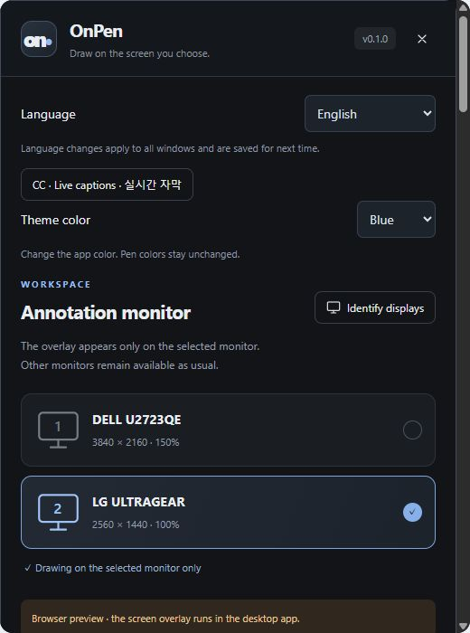

# Quick start

[OnPen](../../README.md) · [Guide index](README.md) · [KR](../KR/01-quick-start.md)

*Actual v0.1 UI in browser preview with sample data; not native runtime verification.*

## Install and launch
1. Download the Windows x64 installer or portable ZIP from [Releases](https://github.com/BAEM1N/layerpen/releases/latest).
2. Run the installer, or extract the ZIP completely and open `OnPen.exe`. Keep the bundled notices and STT files together.
3. Close older OnPen instances. Windows needs WebView2; the installer can obtain it.
4. Open the gear / **on** button and select the monitor to annotate.

## Your first annotation
1. Choose the pen, a color, and a width, then drag over the screen.
2. Press **Ctrl+Shift+D** to click your slides or other apps. Your ink remains.
3. Return to drawing with the same shortcut. Use the mouse tool if a shortcut conflicts.
4. Export a PNG before quitting with the toolbar's final **X**. The settings panel's X only closes settings.

## What persists?
Preferences persist; ink and GIF replay history do not survive a restart. Drawing does not need Python, an API key, or an account. Captions have a separate optional setup.

## Platform status
v0.1 ships unsigned Windows x64 binaries without an automatic updater. macOS native validation is planned for v0.2; there is no verified DMG. Linux is a development target; Wayland is unsupported. Before teaching, test your actual monitor and meeting setup, including what a participant sees.

