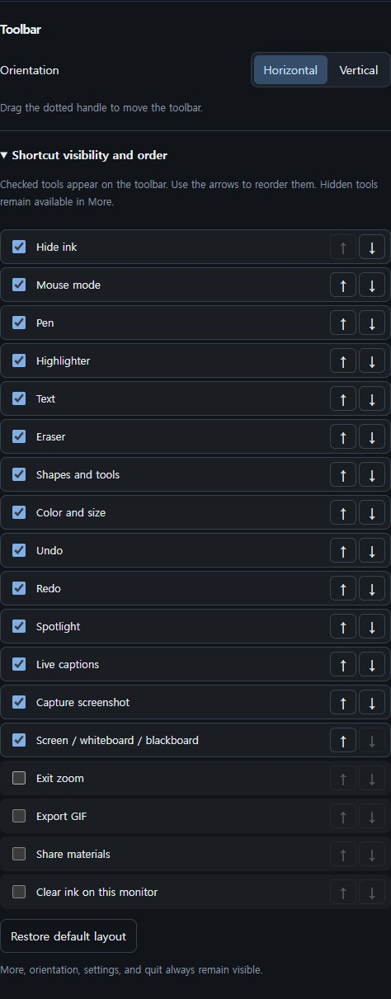
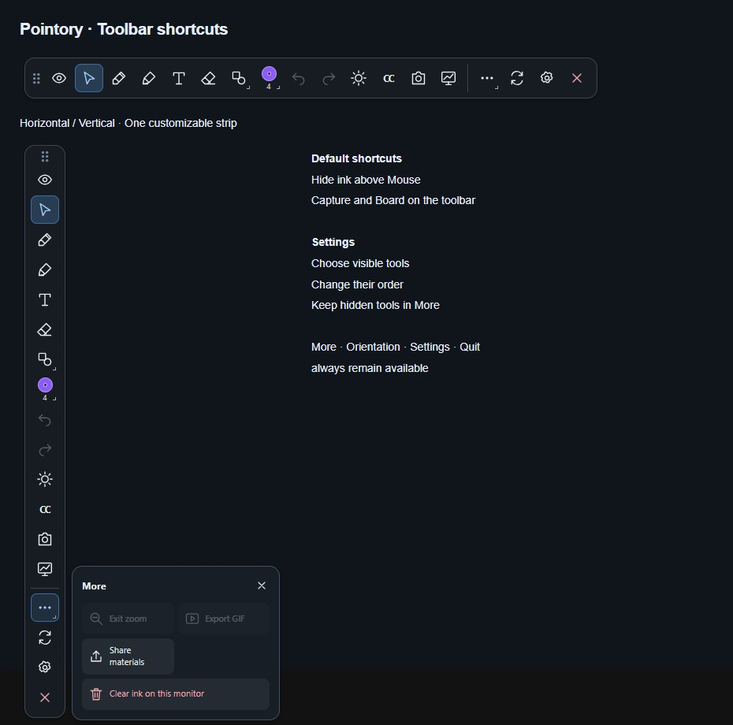

# Toolbar and appearance

[Pointory](../../README.md) · [Guide index](README.md) · [KR](../KR/02-toolbar.md)

*Current development UI in a browser preview with sample data. This is not native runtime verification; interaction on the Mac display still needs onsite testing.*

## Horizontal or vertical

1. Use the toolbar's **Horizontal/Vertical** switch to change direction. You can also choose the direction under **Toolbar** in settings.
2. Drag the dotted grip to move the toolbar.

## Choose and order shortcuts

1. Open **Settings → Toolbar → Shortcut visibility and order**.
2. Check a tool to show its icon on the toolbar. Unchecked tools remain available in **More**.
3. Use **↑ / ↓** next to a tool to move it earlier or later. The same order runs from left to right horizontally and from top to bottom vertically.
4. Use **Restore default layout** to return to the original arrangement. Visibility and order save automatically and persist after restarting.

By default, **Hide ink** comes before Mouse mode. Capture and screen/whiteboard/blackboard switching also have direct toolbar icons. More, orientation, settings, and quit always remain at the end of the toolbar.

## Find a tool

| Location | Tools |
| --- | --- |
| Main toolbar | Hide ink, mouse, pen, highlighter, text, eraser |
| Shapes menu | Line, rectangle, ellipse, select, fading ink, region zoom |
| Color and width panel | Drawing color and the current tool's width |
| Main toolbar | Undo, redo, spotlight, CC captions, screenshot, board switch |
| More menu | Exit zoom, GIF, clear all, share materials, and tools hidden in settings |
| End of toolbar | More, Horizontal/Vertical switch, settings, quit |

The Shapes, Color, and More menus open as panels beside the toolbar.

## Adjust width

Open Color and size to choose from five presets: **2 / 4 / 8 / 16 / 24 px**. Use the slider or number field for a custom width from **1 to 64 px**. Toolbar changes apply immediately to the current tool.

Save frequently used defaults under **Settings → Drawing tools**, separately for pen/shapes, highlighter, and eraser. A temporary toolbar width returns to the saved default when you switch to another tool and back.

## Docked settings

Settings opens beside the toolbar and follows its position. At a screen edge it moves to the available side within the work area. Small displays can cause overlap. The panel X closes settings; the final toolbar X quits the app.

## Theme and palette

Choose an app theme in settings. This changes controls; the drawing palette is separate. Open the Color and width panel to choose drawing colors. Set the first five slots to frequently used colors; the last slot accepts a custom color. Changing the palette does not recolor existing ink.

## Language

The selected language applies to app windows and persists. Experimental captions currently use a Korean/English panel. If controls are cut off, change direction or move the toolbar away from an edge.
