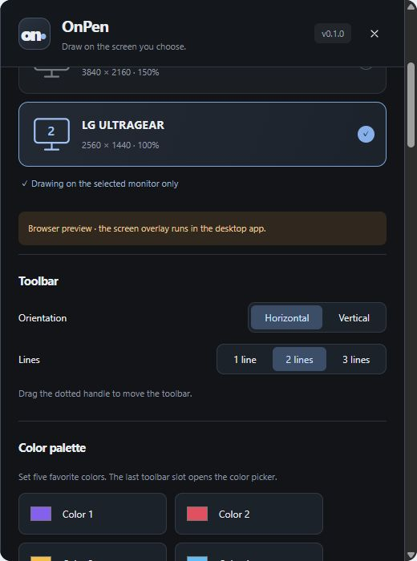

# Toolbar and appearance

[OnPen](../../README.md) · [Guide index](README.md) · [KR](../KR/02-toolbar.md)

*Actual v0.1 UI in browser preview with sample data; not native runtime verification.*

## Six layouts
1. Open settings with the gear / **on** button.
2. Under **Toolbar**, choose Horizontal or Vertical.
3. Select 1, 2, or 3 lines: rows horizontally, columns vertically.
4. Drag the dotted grip to move the toolbar. Use more lines if one line is too long.

The image shows the three vertical variants. The direction setting produces three horizontal variants. Long controls may need scrolling on small displays.

## Docked settings
Settings opens beside the toolbar and follows its position. At a screen edge it moves to the available side within the work area. Small displays can cause overlap. The panel X closes settings; the final toolbar X quits the app.

## Theme and palette
Choose an app theme in settings. This changes controls; the drawing palette is separate. Set the first five slots to frequently used colors; the last toolbar slot accepts a custom color. Changing the palette does not recolor existing ink.

## Language
The selected language applies to app windows and persists. Experimental captions currently use a Korean/English panel. If controls are cut off, change the layout or move the toolbar away from an edge.

