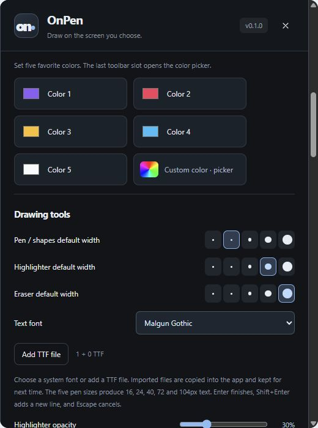
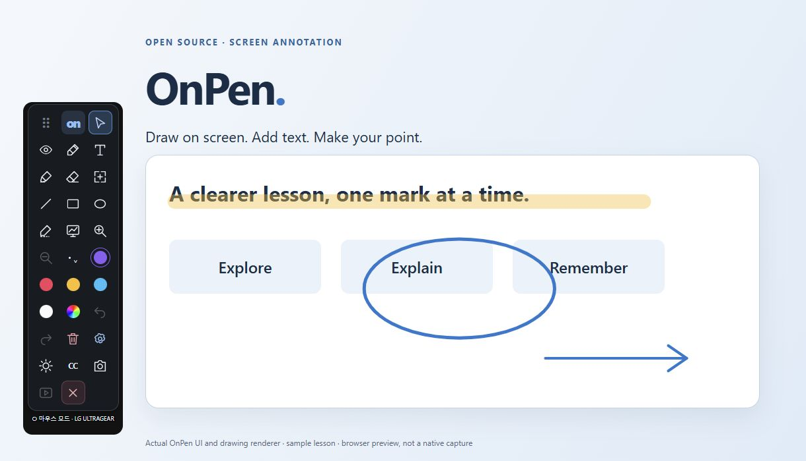

# Drawing and editing

[OnPen](../../README.md) · [Guide index](README.md) · [KR](../KR/03-drawing.md)

*Actual v0.1 UI in browser preview with sample data; not native runtime verification.*

## Draw
1. Choose Pen for solid ink or Highlighter for translucent emphasis.
2. Select a color and width. Pen, marker, and eraser widths are separate.
3. Drag to draw. Line, rectangle, and ellipse tools create shapes from a drag.
4. Switch to Mouse to operate the underlying app without clearing ink.

## Correct an annotation
**Ctrl+Z** undoes and **Ctrl+Shift+Z** redoes. The eraser removes complete strokes it hits, not individual pixels. Select an annotation and drag to move it; use its handles to resize. Committed text can also be moved or resized.

## Clear everything
Click Clear twice within three seconds. This resets the selected monitor's ink and replay history and cannot be undone. Export first. Monitor histories are managed separately.

## Teaching workflow and limits
Highlight one phrase, outline a key detail, then switch to mouse mode to advance your slides. Ink does not follow objects when the underlying app scrolls; clear or move it as slides change. Ink exists only during this session. Test a meeting with a participant: sharing one application window can omit a separate overlay. Text characters cannot be edited after committing; undo or erase and recreate it.

