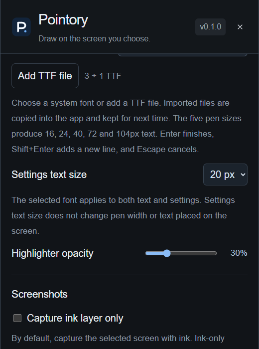

# Text and fonts

[Pointory](../../README.md) · [Guide index](README.md) · [KR](../KR/04-text-fonts.md)

Applying the selected font to settings and adjusting settings text size are available in the current `main` development version and preview builds. These additions are not yet included in the existing v0.1.0 release.

*Actual UI captured on 2026-09-10 in browser preview with sample data and a 20px settings text size; not native runtime verification.*

## Click to type
1. Set the pen width and choose a font under **Drawing tools → Text and settings font**.
2. Click the toolbar **T** icon, then click the intended location on the screen.
3. Type. **Shift+Enter** inserts a newline; **Enter** commits; **Escape** cancels.
4. Use Select to move or resize committed text. To change characters, erase or undo and recreate it.

There is no default T keyboard shortcut. Input methods such as Korean IME are supported by the editor; finish composition before committing.

## Size follows pen width
Use the five presets or adjust pen width from 1 to 64 px with the slider or number input. At normal zoom, widths 2 / 4 / 8 / 16 / 24 produce text sizes 16 / 24 / 40 / 72 / 104 px. New text uses the current font and width. Existing text retains its stored font and size. Zoom uses source coordinates to maintain display sizing.

## Settings font and text size

The font selected under **Text and settings font** applies to new typed annotations and the entire settings window. Both installed system fonts and imported TTF files work with this selector.

Use **Settings text size** directly below it to choose **12 / 14 / 16 / 18 / 20 px**. The default is **14 px**, and the selection is saved for the next launch. Choose 18 or 20 px for larger settings text, then scroll inside the settings window to reach additional controls.

This size setting affects only the settings window. Pen width, text size on the canvas, and toolbar dimensions stay unchanged. Use pen width to control the size of new typed annotations.

## Installed fonts and TTF
The native app scans standard system font directories. Restart Pointory after installing a new font. Fonts only activated inside another font manager may not appear. The screenshot's short preview list is a placeholder, not an inventory of installed fonts.

To add a file, use the TTF import button and select a valid `.ttf` up to 32 MB. Pointory copies it into its own configuration folder; it does not install it system-wide. Duplicate content reuses the same font ID. Imported fonts work in settings, text, PNG, and GIF. Missing characters may use system fallback, so choose a font covering your language and check an export.
