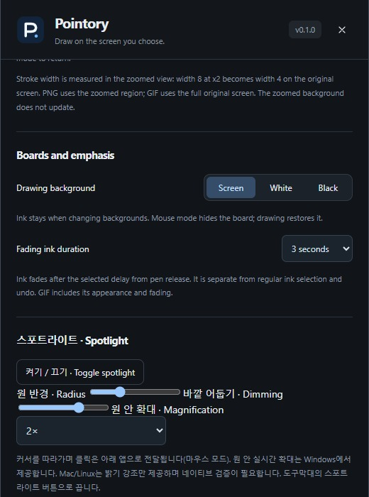

# Zoom, boards, and fading ink

[Pointory](../../README.md) · [Guide index](README.md) · [KR](../KR/05-zoom-boards.md)

*Actual v0.1 UI in browser preview with sample data; not native runtime verification.*

## Frozen-region zoom
1. Choose Zoom (**Z**).
2. Click for 2× zoom, or drag a region to enlarge it up to 6×.
3. Annotate the enlarged detail.
4. Press **0** or the reset-zoom control to return.

The background is a frozen screenshot, not a live magnification feed. Changes in the underlying app will not update it. Exit zoom before selecting a new live scene. PNG exports the current zoom region; GIF uses original full-screen coordinates.

## Board backgrounds
Under **Boards and emphasis**, choose Screen, White, or Black. Existing ink remains when you change backgrounds. Mouse mode lowers the board so you can use the app below; drawing mode restores it. **B** cycles board mode.

## Temporary emphasis
Choose fading ink (**F**) and set its lifetime to 1, 2, 3, 5, or 10 seconds. It disappears after you finish a stroke and its lifetime expires. Use it to point at a detail without accumulating permanent marks. Fading ink is separate from normal selection/undo; GIF history includes its appearance and disappearance.

## Presentation check
Check contrast on a projector and test the board in your actual meeting app. A frozen zoom view can look current while its source has changed; reset it before explaining a new state.

