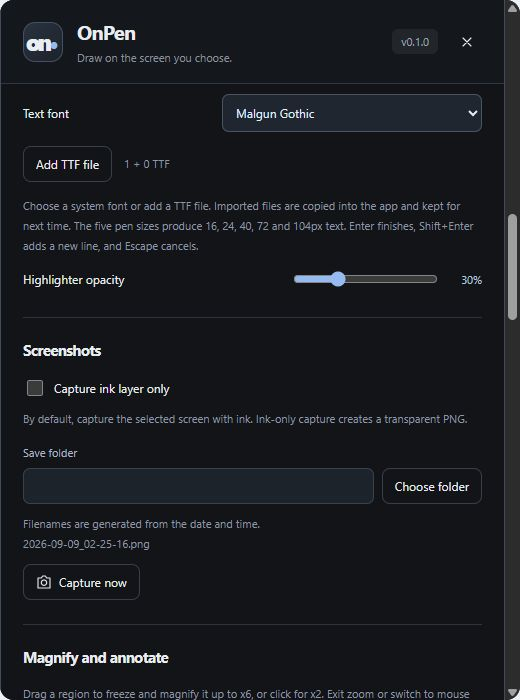

# PNG and GIF export

[OnPen](../../README.md) · [Guide index](README.md) · [KR](../KR/06-export.md)

*Actual v0.1 UI in browser preview with sample data; not native runtime verification.*

## Save a PNG
1. Open **Screenshots** in settings and choose an output folder.
2. Choose whether to save only the annotation layer with transparency or the screen with ink.
3. Click the camera button or press **Ctrl+Shift+S**.
4. Open the saved image and check the selected monitor and content.

The default folder is Pictures/OnPen. Old default product folders are migrated in preferences; existing files are not moved. A custom folder remains unchanged. The native capture excludes the toolbar.

## Export an ink replay GIF
1. Start a clean demonstration after clearing old ink/history if needed.
2. Draw, move, resize, or erase annotations.
3. Choose speed (0.5× / 1× / 2× / 4×), background, and looping in GIF settings.
4. Click GIF or press **Ctrl+Shift+G**. Click the export button again to cancel an active export.

GIF replays annotations since Clear, not desktop video. A screen background is frozen at export time. Output has a maximum long edge of 960 px and normally 10 fps; long histories adapt the frame interval. Transparent GIF cannot preserve all highlighter alpha effects. Files use date/time names in the screenshot folder.

## Avoid lost work
Export before quitting or clearing all. History is per monitor and is not persisted. If saving fails, choose a writable folder and check free space. Do not treat GIF as a replacement for recording live slides, cursor movement, or audio.

