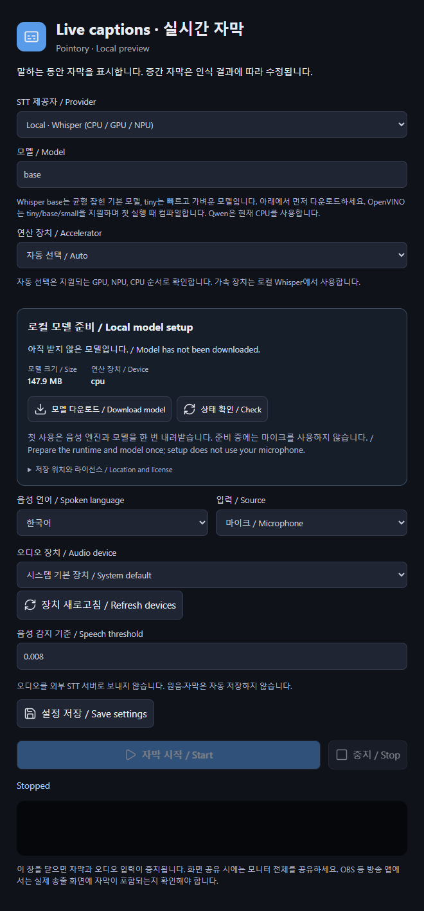
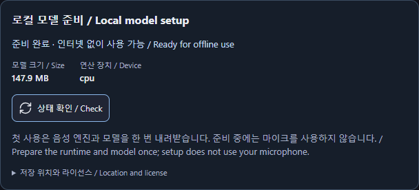
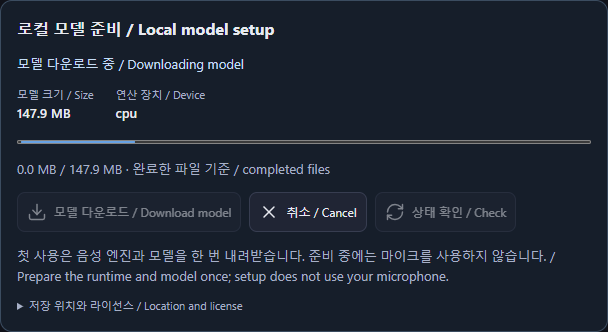
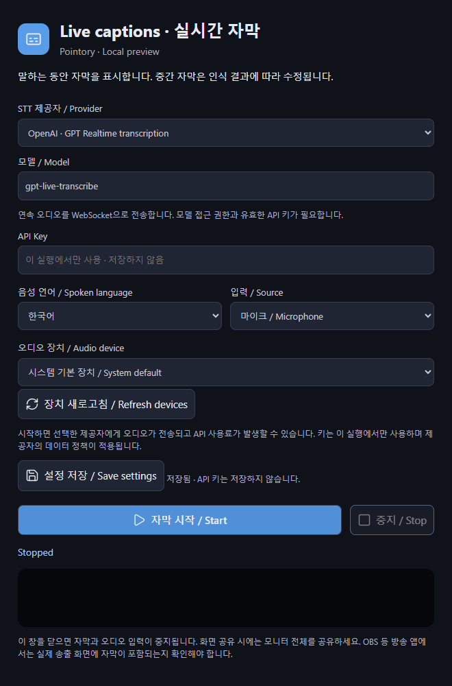

# Live captions (experimental)

[Pointory](../../README.md) · [Guide index](README.md) · [KR](../KR/07-live-captions.md)

*Actual v0.1 UI in browser preview with sample data; not native runtime verification.*

## Prepare local captions
Drawing works without Python. For captions, use **install the engine → download a model → start captions**. Preparing an engine or model does not open the microphone or capture system audio.

1. Install **Python 3.10 or newer** first. For the managed installer, Pointory must be able to find `python` on Windows or `python3` on macOS/Linux. The engine installation button does not install Python itself. See [STT setup](../../docs/STT-SETUP.md) for installation and interpreter paths.
2. Open the toolbar's **caption icon** or **Live captions** in settings. Select **Local Whisper**, a model, and an accelerator. The default `base` model is approximately 148 MB; `tiny` is approximately 78 MB. Engine packages require additional disk space.
3. If the engine is missing, select **Prepare runtime**. It installs packages in Pointory's managed Python environment. Selecting Intel OpenVINO or Qwen requires those engine packages too.
4. Select **Download model**. Check the source, license, approximate size, destination, and preparation state. If you already have a compatible model, you can enter its local folder path in the Model field.
5. Once the model is ready, choose the spoken language, microphone or system audio, and the actual audio device. **Refresh devices** after plugging in a microphone.
6. Click **Start**. Speak and check both the caption and reported runtime device. Stop or close the caption configuration window to release audio capture. The first OpenVINO start may take longer while the prepared model is compiled locally.

Auto chooses among detected supported accelerators, or CPU if none is available. Model preparation and caption startup use the same resolved device. If GPU/NPU initialization fails, **select CPU, prepare its model, and try again**. Installing an engine does not install GPU drivers.

If you explicitly set `POINTORY_STT_PYTHON` or a legacy Python override, **Prepare runtime** reports `runtime_override`. Install `stt/requirements.txt` and any required engine packages in that environment yourself, or remove all speech Python overrides and restart Pointory to use its managed installer. See [Custom Python environments](../../docs/STT-SETUP.md#custom-python-environments).

## Cancel, resume, and storage

Use **Cancel** to stop preparation. Completed files and resumable download data are retained. Retry the same download to reuse those files and resume transfers where the host supports it. Progress counts completed files, so it may remain still during a large weights download. A canceled or incomplete model is not marked ready.

New models are stored under `~/.cache/pointory/` in your home directory, for example `whisper-base` or `ov-whisper-base`. Complete compatible models in older Hugging Face, OnPen, or LayerPen caches are reused in place. See [Model storage](../../docs/STT-SETUP.md#model-storage) to change the location.

Closing the captions settings window lets model downloads and engine installation continue. Reopen it to see progress. **Cancel** or quit Pointory to stop the active preparation job.

## GPU and NPU expectations
Whisper supports CPU, optional CUDA, and optional Intel OpenVINO GPU/NPU paths where drivers, packages, and models are compatible. Device availability is probed; having an NPU does not guarantee a usable model. OpenVINO supports the implemented tiny/base/small paths. Qwen local CPU is experimental. Apple Metal/Core ML/ANE acceleration is not implemented and validated in this release.

## API providers

Cloud providers **do not need a local model download**. If Python worker dependencies are missing, the API provider screen shows **Speech runtime setup**. Select **Prepare runtime** there to install the packages while keeping your API provider selected. With an explicit Python override, install dependencies in that environment yourself. Enter your API key and a model available to your account, then choose an audio device and Start. Audio goes to that provider. Keys are used for the current run and are not saved with preferences. Provider access, model compatibility, and billing depend on your account; live cloud transcription has not been verified with a paid key in this release.

## Troubleshooting
Engine installation failed: check the Python path, internet connection, and free disk space. Download interrupted: retry the same model. No words: check the selected device, microphone permissions, and speech threshold. Missing accelerator: check its driver and optional runtime. Do not change models during an active session; stop first. Screenshots use preview controls, not a successful audio or hardware test. The app does not save audio recordings.
