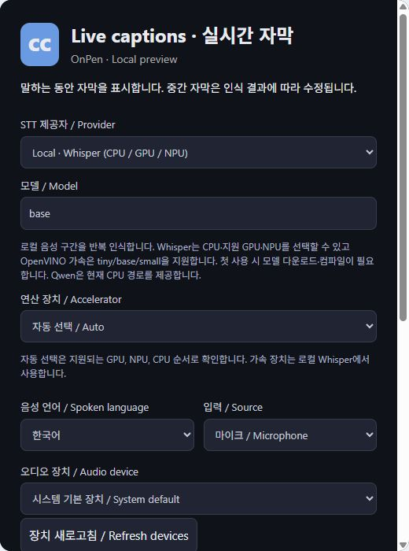
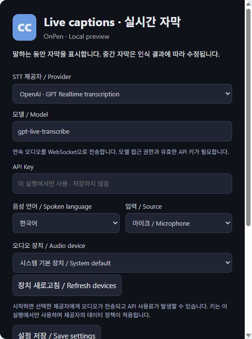

# Live captions (experimental)

[OnPen](../../README.md) · [Guide index](README.md) · [KR](../KR/07-live-captions.md)

*Actual v0.1 UI in browser preview with sample data; not native runtime verification.*

## Prepare local captions
Drawing works without Python. For captions, follow [STT setup](../../docs/STT-SETUP.md) to install the worker dependencies. The Windows setup script creates a separate OnPen Python environment. Local models may need an initial download.

1. Open **CC** in the toolbar or Live captions in settings.
2. Select Local Whisper and a model. Start with a small supported model.
3. Select Auto or a detected accelerator. Auto can fall back to CPU; an explicitly unsupported device produces an error.
4. Choose the spoken language, microphone or system audio, and the actual audio device. Refresh devices after plugging in a microphone.
5. Click Start. Speak and check both the caption and reported runtime device. Stop or close the caption configuration window to release audio capture.

## GPU and NPU expectations
Whisper supports CPU, optional CUDA, and optional Intel OpenVINO GPU/NPU paths where drivers, packages, and models are compatible. Device availability is probed; having an NPU does not guarantee a usable model. OpenVINO supports the implemented tiny/base/small paths. Qwen local CPU is experimental. Apple Metal/Core ML/ANE acceleration is not implemented and validated in this release.

## API providers

Select a cloud provider, enter your API key and a model available to your account, then choose an audio device and Start. Audio goes to that provider. Keys are used for the current run and are not saved with preferences. Provider access, model compatibility, and billing depend on your account; live cloud transcription has not been verified with a paid key in this release.

## Troubleshooting
No words: check the selected device, microphone permissions, and speech threshold. Missing accelerator: check its driver and optional runtime. Do not change models during an active session; stop first. Screenshots use preview controls, not a successful audio or hardware test. The app does not save audio recordings.

