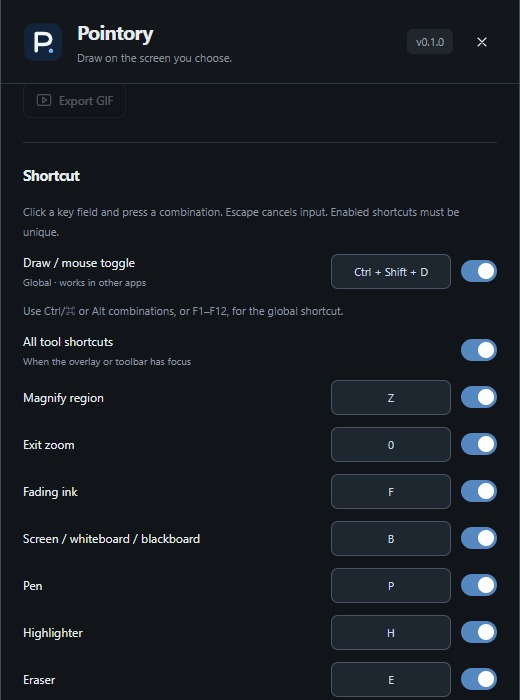

# Keyboard shortcuts

[Pointory](../../README.md) · [Guide index](README.md) · [KR](../KR/08-shortcuts.md)

*Actual v0.1 UI in browser preview with sample data; not native runtime verification.*

## Global drawing toggle
**Ctrl+Shift+D** on Windows switches drawing and mouse interaction. Change or disable the global shortcut in settings if another app uses it. The toolbar remains an alternative.

## Default tool bindings
| Key | Action |
| --- | --- |
| P / H / E | Pen / Highlighter / Eraser |
| V / L / R / O | Select / Line / Rectangle / Ellipse |
| Z / 0 | Zoom / Reset zoom |
| B / F / M | Board / Fading ink / Mouse |
| Tab | Show or hide ink |
| Ctrl+Z / Ctrl+Shift+Z | Undo / Redo |
| Ctrl+Shift+S / Ctrl+Shift+G | PNG / GIF |
| Ctrl+Shift+Delete, twice | Clear ink and replay history |
| 1–5 | Palette slots |
| [ / ] | Narrower / Wider |

Tool shortcuts normally require the overlay/tool window to have focus; they are not all global shortcuts. Inputs, text editing, and settings avoid tool shortcuts. Use the T icon for text; T is not bound by default.

## Customize
Open Shortcut settings, select the action, and set the intended combination. Avoid duplicate bindings and conflicts with presentation software. You can turn off tool shortcuts while keeping the global drawing toggle. Test a combination with the application you use during teaching. During text entry, Enter commits, Shift+Enter inserts a newline, and Escape cancels.

