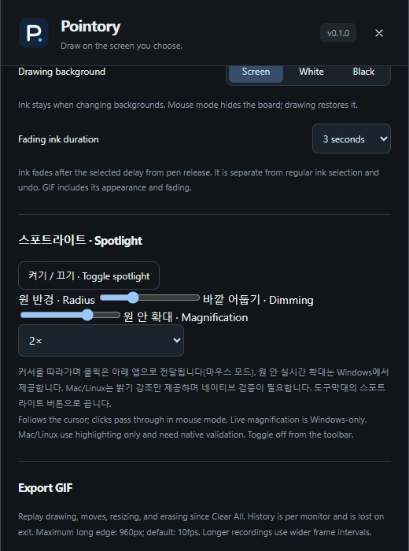
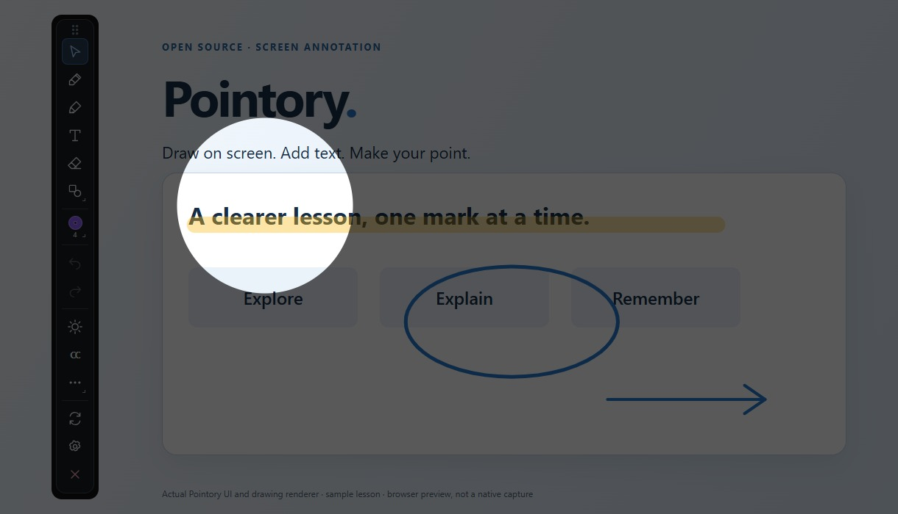

# Cursor spotlight and circular magnifier

[Pointory](../../README.md) · [Guide index](README.md) · [한국어](../KR/11-spotlight.md)

*Actual settings UI in browser preview. The example below applies the real spotlight rendering code to an authored lesson; it demonstrates highlighting, not verified native magnification.*

## Turn on and use

1. Select the annotation monitor.
2. Click the circular light **Spotlight** icon in the toolbar, or **Toggle spotlight** in settings.
3. Move the mouse: a bright circle follows the pointer while the outside is dimmed.
4. Use mouse mode to click your slides or apps underneath. Drawing mode continues to annotate normally.
5. Click the spotlight button again to turn it off. Changing the selected monitor stops it. Moving the cursor to another monitor hides the effect.

## Customize

| Setting | Range | Purpose |
| --- | --- | --- |
| Radius | 40–300 logical pixels | Highlight an icon, a phrase, or a larger detail |
| Dimming | 10–90% | Keep more or less background context visible |
| Magnification | 1 / 1.5 / 2 / 3× | 1× highlights only; other values magnify the circle |

Preferences persist, but spotlight does not automatically start on launch. The existing Z region zoom is a separate feature that freezes and enlarges a screen region.

## Support and sharing

Windows repeatedly captures the area inside the lens. Cursor positions update more frequently than the magnified image, which refreshes at intervals of at least approximately 125 ms. Fast movement and video can lag. Near an edge, the captured source region is clamped inside the monitor. Capture-protected content may not magnify correctly.

Mac/Linux currently apply highlighting without magnification and still require native validation. The Windows effect window is excluded from capture to prevent capturing itself. Pointory's LAN live view reapplies the effect to outgoing frames. Do not assume normal PNG/GIF export or another meeting/recording app includes it. Verify the actual monitor scaling, projector, and student device before presenting.

This is an independent implementation using a normal mouse cursor, not Logitech hardware pairing or remote-button integration.
