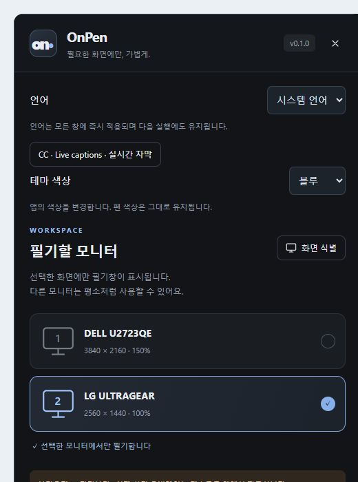

# 설치와 첫 실행

[OnPen](../../README.md) · [Guide index](README.md) · [EN](../EN/01-quick-start.md)

*v0.1 실제 UI의 예제 데이터 기반 브라우저 미리보기이며 네이티브 실행 검증 화면은 아닙니다.*

## 설치와 실행
1. [릴리스](https://github.com/BAEM1N/layerpen/releases/latest)에서 Windows x64 설치 EXE 또는 포터블 ZIP을 받습니다.
2. 설치하거나 ZIP을 모두 풀고 `OnPen.exe`를 실행합니다. 동봉된 안내와 STT 파일은 함께 보관합니다.
3. 이전 OnPen을 먼저 종료합니다. Windows에서는 WebView2가 필요하며 설치본에서 받을 수 있습니다.
4. 톱니바퀴 **설정** 버튼에서 필기할 모니터를 선택합니다.

## 첫 필기
1. 펜과 색상, 굵기를 고른 뒤 화면을 드래그합니다.
2. **Ctrl+Shift+D**를 눌러 아래 프로그램을 클릭합니다. 필기는 남아 있습니다.
3. 같은 단축키로 필기로 돌아옵니다. 단축키가 겹치면 마우스 도구를 사용합니다.
4. 종료 전에 PNG로 저장합니다. 툴바 맨 끝 **X**는 앱 종료이고 설정 패널의 X는 설정만 닫습니다.

## 저장되는 항목
설정은 다음 실행에도 유지됩니다. 필기와 GIF 기록은 앱 재시작 시 사라집니다. 일반 필기에는 Python, API 키, 계정이 필요 없습니다. 자막은 별도로 설정하는 선택 기능입니다.

## 지원 범위
v0.1은 Windows x64용입니다. 아직 코드 서명과 자동 업데이트가 없습니다. macOS는 v0.2에서 실제 검증할 예정이며 검증된 DMG는 없습니다. Linux는 개발 대상이고 Wayland는 미지원입니다. 수업 전에 수강생에게 보이는 화면을 확인하세요.

