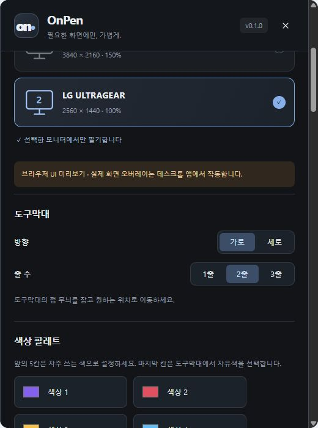
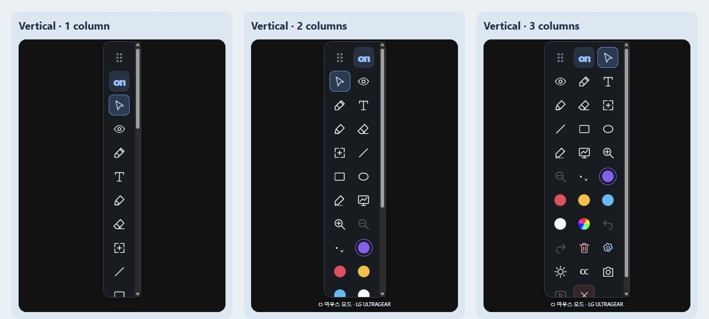

# 툴바와 색상 설정

[OnPen](../../README.md) · [Guide index](README.md) · [EN](../EN/02-toolbar.md)

*v0.1 실제 UI의 예제 데이터 기반 브라우저 미리보기이며 네이티브 실행 검증 화면은 아닙니다.*

## 6가지 배치
1. **톱니바퀴 / on** 버튼으로 설정을 엽니다.
2. **도구막대**에서 가로 또는 세로를 선택합니다.
3. 1줄, 2줄, 3줄을 고릅니다. 가로일 때는 행 수, 세로일 때는 열 수입니다.
4. 점 무늬 손잡이를 잡아 이동합니다. 한 줄이 너무 길면 두 줄이나 세 줄을 사용합니다.

위 이미지는 세로 배치 세 가지이며 방향을 바꾸면 가로 배치 세 가지가 됩니다. 작은 화면에서는 긴 툴바를 스크롤해야 할 수 있습니다.

## 툴바 옆 설정
설정은 툴바 옆에 열리고 이동을 따라갑니다. 가장자리에서는 공간이 있는 쪽으로 배치하며 작업 영역에 맞춥니다. 작은 화면에서는 다른 내용과 겹칠 수 있습니다. 패널 X는 설정만 닫고 툴바 마지막 X는 앱을 종료합니다.

## 테마와 필기 색상
테마는 컨트롤 색상이고 필기 팔레트는 별도입니다. 앞 다섯 칸은 자주 쓰는 색으로 설정하고 마지막 칸은 자유색을 고릅니다. 이미 그린 선의 색은 바뀌지 않습니다.

## 언어
선택한 언어는 앱 창에 적용되고 다음 실행에도 유지됩니다. 실험적 자막은 현재 한국어/영어 병기입니다. 버튼이 잘리면 배치를 바꾸거나 가장자리에서 툴바를 옮기세요.

