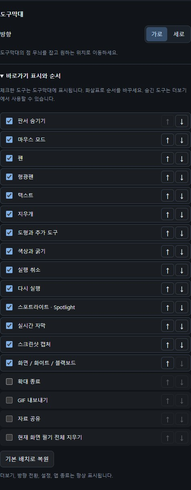

# 툴바와 색상 설정

[Pointory](../../README.md) · [Guide index](README.md) · [EN](../EN/02-toolbar.md)

*현재 개발 버전 UI의 예제 데이터 기반 브라우저 미리보기입니다. 네이티브 실행 검증 화면은 아니며 Mac의 실제 화면 조작은 현장 검증이 필요합니다.*

## 가로·세로 방향

1. 툴바의 **가로/세로 전환** 버튼으로 방향을 바꿉니다. 설정의 **도구막대**에서도 선택할 수 있습니다.
2. Pointory 심볼을 잡아 툴바를 이동합니다.

## 바로가기 표시와 순서

1. **설정 → 도구막대 → 바로가기 표시와 순서**를 펼칩니다.
2. 자주 쓰는 도구를 체크하면 툴바에 아이콘이 표시됩니다. 체크를 해제한 도구도 **더보기**에서 계속 사용할 수 있습니다.
3. 도구 오른쪽 **↑ / ↓**로 순서를 바꿉니다. 가로에서는 왼쪽부터, 세로에서는 위쪽부터 같은 순서를 사용합니다.
4. **기본 배치로 복원**을 누르면 처음 배치로 돌아갑니다. 변경한 표시 목록과 순서는 자동 저장되며 다음 실행에도 유지됩니다.

기본 배치에서는 **판서 숨기기**가 마우스 모드 앞에 있습니다. 캡처와 화면/화이트/블랙보드 전환도 바로 누를 수 있는 아이콘으로 표시됩니다. 더보기, 방향 전환, 설정, 앱 종료는 항상 툴바 끝에 남습니다.

## 도구 찾기

| 위치 | 도구 |
| --- | --- |
| 기본 툴바 | 판서 숨기기, 마우스, 펜, 형광펜, 텍스트, 지우개 |
| 도형 메뉴 | 직선, 사각형, 타원, 선택, 사라지는 잉크, 부분 확대 |
| 색상·굵기 패널 | 필기 색상과 현재 도구의 굵기 |
| 기본 툴바 | 실행 취소, 다시 실행, 스포트라이트, CC 자막, 화면 캡처, 보드 전환 |
| 더보기 메뉴 | 확대 종료, GIF, 전체 지우기, 자료 공유, 설정에서 숨긴 도구 |
| 툴바 끝 | 더보기, 가로/세로 전환, 설정, 앱 종료 |

도형·색상·더보기 메뉴는 툴바 옆 패널로 열립니다.

## 굵기 조절

색상·굵기 아이콘을 열면 **2 / 4 / 8 / 16 / 24 px** 다섯 프리셋을 선택할 수 있습니다. 원하는 굵기가 없으면 슬라이더 또는 숫자 입력으로 **1~64 px** 사이를 직접 지정합니다. 툴바에서 고른 굵기는 현재 도구에 바로 적용됩니다.

자주 쓸 기본값은 **설정 → 필기 도구**에서 펜·도형, 형광펜, 지우개별로 저장하세요. 툴바에서 임시로 바꾼 굵기는 다른 도구로 전환했다가 돌아오면 저장된 기본값으로 돌아갑니다.

## 툴바 옆 설정

설정은 툴바 옆에 열리고 이동을 따라갑니다. 가장자리에서는 공간이 있는 쪽으로 배치하며 작업 영역에 맞춥니다. 작은 화면에서는 다른 내용과 겹칠 수 있습니다. 패널 X는 설정만 닫고 툴바 마지막 X는 앱을 종료합니다.

## 테마와 필기 색상

테마는 설정에서 고르는 컨트롤 색상이며 필기 팔레트와 별도입니다. 색상·굵기 패널에서 필기 색을 고릅니다. 앞 다섯 칸은 자주 쓰는 색으로 설정하고 마지막 칸은 자유색을 고릅니다. 이미 그린 선의 색은 바뀌지 않습니다.

## 언어

선택한 언어는 앱 창에 적용되고 다음 실행에도 유지됩니다. 실험적 자막은 현재 한국어/영어 병기입니다. 버튼이 잘리면 방향을 바꾸거나 가장자리에서 툴바를 옮기세요.
