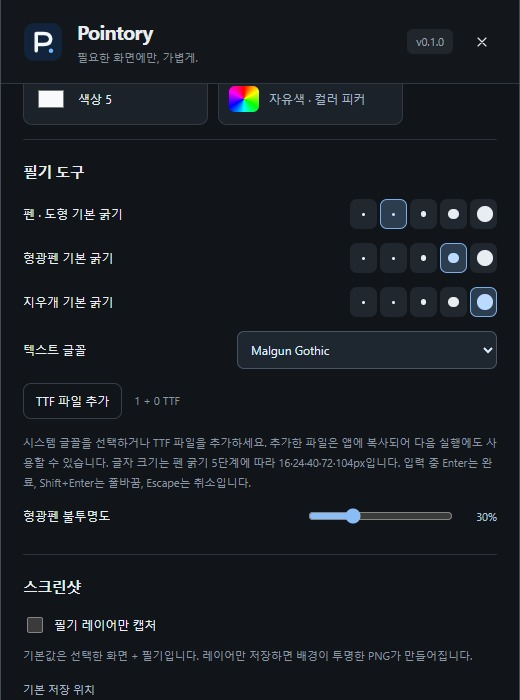

# 텍스트와 글꼴

[Pointory](../../README.md) · [Guide index](README.md) · [EN](../EN/04-text-fonts.md)

*v0.1 실제 UI의 예제 데이터 기반 브라우저 미리보기이며 네이티브 실행 검증 화면은 아닙니다.*

## 클릭해서 입력
1. 펜 굵기를 정하고 **그리기 도구 → 텍스트 글꼴**에서 글꼴을 고릅니다.
2. 툴바 **T** 아이콘을 누르고 화면의 원하는 위치를 클릭합니다.
3. 입력 후 **Enter**로 완료합니다. **Shift+Enter**는 줄바꿈, **Escape**는 취소입니다.
4. 완료한 텍스트는 선택 도구로 이동·크기 변경합니다. 글자 수정은 지우거나 취소한 뒤 다시 입력합니다.

T 키 자체는 기본 단축키가 아닙니다. 한글 IME 조합을 마친 뒤 입력을 완료하세요.

## 펜 굵기와 글자 크기
일반 배율에서 펜 굵기 2 / 4 / 8 / 16 / 24는 글자 크기 16 / 24 / 40 / 72 / 104 px에 대응합니다. 새 텍스트에 현재 글꼴과 굵기를 적용하고 기존 텍스트는 저장된 값을 유지합니다. 확대 화면에서는 원본 좌표를 기준으로 크기를 보정합니다.

## 설치 글꼴과 TTF
네이티브 앱은 시스템의 표준 글꼴 폴더를 읽습니다. 새 글꼴 설치 후 Pointory를 재시작하세요. 글꼴 관리 앱에서만 활성화한 글꼴은 누락될 수 있습니다. 스크린샷의 짧은 목록은 미리보기용이며 실제 설치 글꼴 목록이 아닙니다.

TTF 추가 버튼에서 32 MB 이하의 유효한 `.ttf`를 고릅니다. 앱 설정 폴더로 복사하며 시스템 전체에는 설치하지 않습니다. 같은 파일은 같은 글꼴 ID를 사용합니다. 가져온 글꼴은 텍스트·PNG·GIF에 적용됩니다. 지원하지 않는 문자는 시스템 대체 글꼴이 쓰일 수 있으므로 언어를 지원하는 글꼴을 고르고 결과물을 확인하세요.

