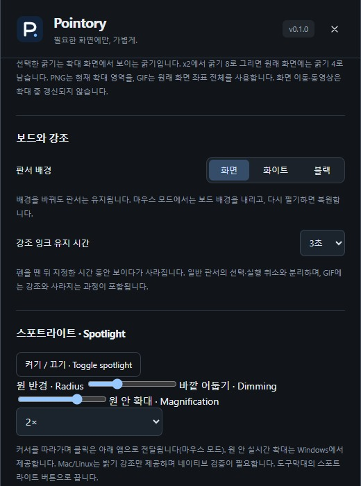

# 확대·보드·강조 잉크

[Pointory](../../README.md) · [Guide index](README.md) · [EN](../EN/05-zoom-boards.md)

*v0.1 실제 UI의 예제 데이터 기반 브라우저 미리보기이며 네이티브 실행 검증 화면은 아닙니다.*

## 정지 화면 확대
1. 확대 도구(**Z**)를 선택합니다.
2. 클릭하면 2배, 영역을 드래그하면 최대 6배까지 확대합니다.
3. 확대된 세부 내용에 필기합니다.
4. **0** 또는 확대 초기화 버튼으로 돌아옵니다.

배경은 정지 스크린샷이며 실시간 확대 영상이 아닙니다. 아래 앱이 바뀌어도 갱신되지 않으므로 확대를 종료하고 새 장면을 선택하세요. PNG는 현재 확대 영역을, GIF는 원래 전체 화면 좌표를 사용합니다.

## 보드 배경
**보드와 강조**에서 화면·화이트·블랙을 선택합니다. 배경을 바꿔도 필기는 유지됩니다. 마우스 모드에서는 보드를 내려 아래 앱을 조작하고 필기 모드에서는 복원합니다. **B**로 보드를 순환합니다.

## 잠시 강조하기
강조 잉크(**F**)를 고르고 유지 시간을 1·2·3·5·10초 중 선택합니다. 선을 그린 뒤 지정 시간이 지나면 사라져 판서가 쌓이지 않습니다. 일반 필기의 선택·실행 취소와 별개로 관리하며 GIF에는 나타나고 사라지는 과정이 포함됩니다.

## 수업 전 확인
프로젝터에서 대비가 충분한지, 회의 앱에서 보드가 보이는지 확인합니다. 확대 배경은 원본 화면이 바뀌어도 정지 상태이므로 새로운 내용을 설명하기 전에 초기화하세요.

