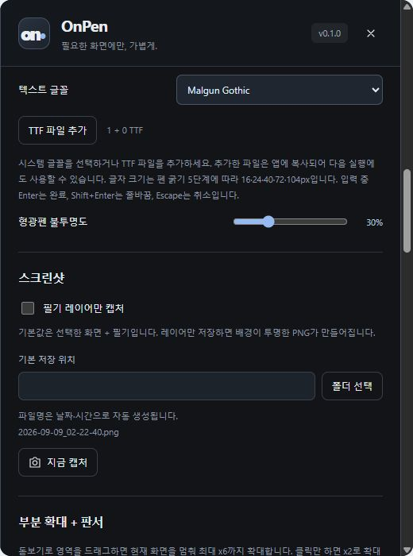

# PNG·GIF 저장

[OnPen](../../README.md) · [Guide index](README.md) · [EN](../EN/06-export.md)

*v0.1 실제 UI의 예제 데이터 기반 브라우저 미리보기이며 네이티브 실행 검증 화면은 아닙니다.*

## PNG 저장
1. 설정의 **스크린샷**에서 저장 폴더를 선택합니다.
2. 투명 배경의 필기 레이어만 저장할지 화면과 함께 저장할지 고릅니다.
3. 카메라 버튼 또는 **Ctrl+Shift+S**를 누릅니다.
4. 파일을 열어 선택한 모니터와 내용이 맞는지 확인합니다.

기본 폴더는 Pictures/OnPen입니다. 이전 제품명의 기본 경로는 설정에서 전환하지만 기존 파일을 이동하지 않습니다. 직접 지정한 폴더는 유지합니다. 네이티브 캡처에서는 툴바를 제외합니다.

## 필기 GIF 내보내기
1. 필요하면 전체 지우기로 이전 필기와 기록을 초기화합니다.
2. 필기하고 이동·크기 변경·삭제합니다.
3. GIF 설정에서 속도(0.5·1·2·4배), 배경, 반복 여부를 선택합니다.
4. GIF 버튼 또는 **Ctrl+Shift+G**를 누릅니다. 진행 중 버튼을 다시 누르면 취소합니다.

GIF는 전체 지우기 이후의 필기를 재생하며 데스크톱 동영상이 아닙니다. 화면 배경은 내보내기 시점의 정지 화면입니다. 긴 변 최대 960 px, 기본 10 fps이며 긴 기록은 프레임 간격을 조정합니다. 투명 GIF는 형광펜의 모든 반투명 효과를 보존하지 못합니다. 스크린샷 폴더에 날짜·시간 이름으로 저장합니다.

## 유실 방지
종료하거나 전체 지우기 전에 저장하세요. 기록은 모니터별이며 앱 종료 시 유지되지 않습니다. 실패하면 쓰기 가능한 폴더와 남은 공간을 확인합니다. GIF는 슬라이드 변화·커서·음성 녹화를 대신하지 않습니다.

