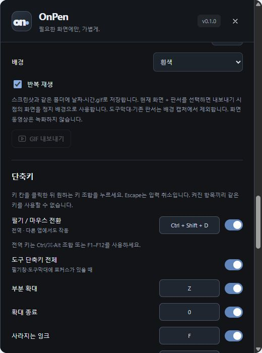

# 키보드 단축키

[OnPen](../../README.md) · [Guide index](README.md) · [EN](../EN/08-shortcuts.md)

*v0.1 실제 UI의 예제 데이터 기반 브라우저 미리보기이며 네이티브 실행 검증 화면은 아닙니다.*

## 전역 필기 전환
Windows **Ctrl+Shift+D**로 필기와 마우스 조작을 전환합니다. 다른 앱과 겹치면 설정에서 전역 단축키를 바꾸거나 끄고 툴바를 사용합니다.

## 기본 도구 단축키
| 키 | 동작 |
| --- | --- |
| P / H / E | 펜 / 형광펜 / 지우개 |
| V / L / R / O | 선택 / 직선 / 사각형 / 타원 |
| Z / 0 | 확대 / 확대 초기화 |
| B / F / M | 보드 / 강조 잉크 / 마우스 |
| Tab | 필기 표시·숨김 |
| Ctrl+Z / Ctrl+Shift+Z | 실행 취소 / 다시 실행 |
| Ctrl+Shift+S / Ctrl+Shift+G | PNG / GIF |
| Ctrl+Shift+Delete 두 번 | 필기와 재생 기록 초기화 |
| 1–5 | 팔레트 색상 |
| [ / ] | 가늘게 / 굵게 |

도구 단축키는 주로 오버레이나 도구 창에 포커스가 있을 때 작동하며 모두 전역 단축키인 것은 아닙니다. 입력 칸·텍스트 편집·설정에서는 도구 단축키를 피합니다. 텍스트는 T 아이콘으로 선택하며 T 키 기본 바인딩은 없습니다.

## 변경
단축키 설정에서 동작을 고르고 원하는 조합을 지정합니다. 중복과 발표 프로그램 충돌을 피하세요. 도구 단축키만 끄고 전역 전환은 유지할 수 있습니다. 실제 수업 앱과 함께 조합을 확인하세요. 텍스트 입력 중 Enter는 완료, Shift+Enter는 줄바꿈, Escape는 취소입니다.

