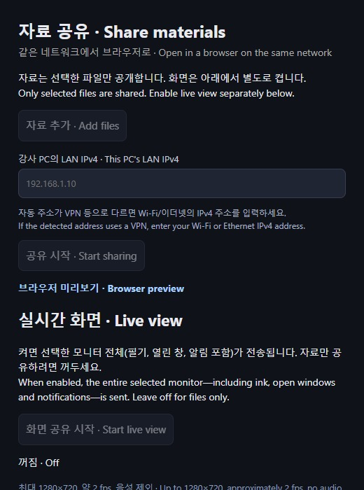
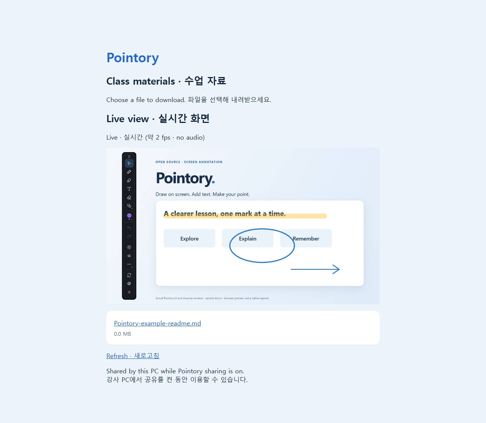

# 같은 네트워크 자료 공유와 실시간 화면

[Pointory](../../README.ko.md) · [사용 가이드](README.md) · [English](../EN/10-classroom-sharing.md)

*실제 설정 UI의 브라우저 미리보기입니다. 아래 수강생 화면은 실제 로컬 HTTP 서버에 예제 파일과 정지 예제 프레임을 넣어 캡처했습니다. 실제 교실의 다른 기기나 네이티브 화면 전송 검증을 대신하지 않습니다.*

## 강사가 자료 공개하기

1. Pointory 설정에서 **자료 공유 · Share materials**를 엽니다.
2. **자료 추가**에서 공개할 PDF, 슬라이드, 문서, PNG 등 파일을 선택합니다. 폴더 전체를 공개하지 않습니다. 최대 100개이며 같은 경로는 중복 추가하지 않습니다.
3. 자동 표시된 IPv4 주소가 수업용 Wi-Fi 또는 이더넷 주소인지 확인합니다. VPN 등 다른 주소이면 해당 네트워크의 IPv4를 입력합니다.
4. **공유 시작**을 누릅니다. 사용 가능한 포트를 자동 선택하며 접속 주소와 QR이 표시됩니다.
5. 주소를 복사하거나 QR을 수강생에게 보여줍니다. 수강생은 같은 네트워크에서 브라우저로 접속합니다. 별도 앱·계정은 필요 없습니다.

주소를 받은 사람이 파일을 받을 수 있습니다. HTTP 연결은 암호화되지 않으므로 신뢰하는 수업 네트워크에서 사용합니다. 자료를 목록에서 제거하면 이후 다운로드가 중단되지만 이미 내려받은 사본은 회수되지 않습니다. 선택한 원본 파일을 옮기거나 지우면 다운로드가 실패할 수 있습니다. 원본을 수정하면 수정된 파일이 전달됩니다.

## 현재 필기 화면 보여주기

1. 먼저 필기할 모니터를 선택하고 공유할 화면을 준비합니다.
2. 자료 공유를 시작한 상태에서 **화면 공유 시작**을 누릅니다.
3. 수강생 페이지의 실시간 화면 영역에서 선택한 모니터를 확인합니다.
4. 쉬는 시간이나 다른 작업을 할 때 **화면 공유 중지**를 누릅니다. 자료 다운로드는 유지됩니다.

선택한 모니터 전체를 캡처하므로 필기뿐 아니라 툴바·열린 창·알림도 포함됩니다. 공유 설정 창은 다른 모니터로 옮기거나 닫을 수 있습니다. 모니터를 변경하면 화면 전송은 중지하며 다시 시작해야 합니다. 최대 1280×720, 약 2 fps의 JPEG 갱신 방식으로 음성은 전송하지 않습니다. 고속 동영상·화상회의용 기능은 아니며 화면 크기, 네트워크, PC 성능에 따라 속도가 낮아집니다.

## 수강생 사용법

1. 강사와 같은 네트워크에 연결합니다.
2. QR을 스캔하거나 전달받은 `http://IPv4:포트/임의주소/`를 브라우저에 엽니다. 임의주소를 포함해 전체 URL을 사용하세요.
3. 자료 이름을 눌러 다운로드합니다. 파일은 강사 PC에서 직접 전달됩니다. 브라우저에서 PDF 미리보기를 제공하는 기능은 아직 없습니다.
4. 강사가 화면 공유를 켜면 같은 페이지에서 자동 갱신됩니다. 자료 목록 변경은 **새로고침**으로 확인합니다.

## 중지와 연결 문제

- **공유 중지** 또는 앱 종료는 서버와 화면 전송을 종료합니다. 패널만 닫으면 계속 공유합니다.
- 중지 후 다시 시작하면 임의 접속 주소와 포트가 바뀔 수 있습니다. 새 QR/주소를 전달하세요. 목록은 현재 앱 실행 동안 유지되고 재시작하면 비워집니다.
- Windows 방화벽에서 필요한 사설 네트워크의 앱 접속을 허용합니다. Pointory가 방화벽이나 공유기 포트 포워딩을 자동 변경하지 않습니다.
- 학교·게스트 Wi-Fi의 기기 간 격리, 서로 다른 VLAN, VPN, 잘못된 IPv4는 접속을 막을 수 있습니다. 이 경우 네트워크 관리자에게 기기 간 통신 가능 여부를 확인합니다.
- IPv4 사설/링크 로컬 주소가 대상입니다. 인터넷 공개, IPv6, HTTPS, 업로드, 계정 관리는 포함하지 않습니다.
- 화면이 대기 상태이면 강사 설정의 오류, 화면 캡처 권한, 선택한 모니터를 확인합니다. macOS/Linux 실제 화면 공유와 교실 다중 접속 부하 검증은 아직 남아 있습니다.
