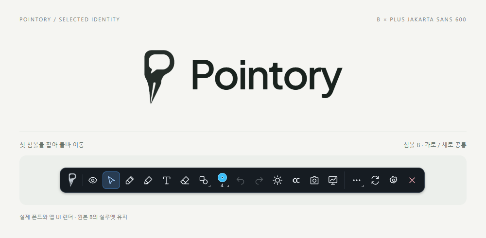
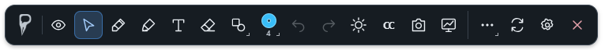

# Pointory identity

The approved symbol is **B**, with a medium stroke weight and a long nib pointing down-left. `ui/assets/pointory-symbol-b.png` preserves the approved source bytes; its SHA-256 is recorded in `manifest.json`.

The selected wordmark is **Plus Jakarta Sans 600**, with `Pointory` capitalization and initial tracking of `-0.035em`. It balances the symbol's rounded counter and weight with an approachable tone for teachers, presenters, and meeting participants. This is the brand wordmark selection; the settings UI continues to use the user's chosen font.

## Toolbar use

The first toolbar item is the symbol and remains the window drag handle. Both orientations use a 36 × 36 CSS px drag target and a 16 × 28 CSS px symbol, without rotating the artwork. A grab/grabbing cursor, hover state, localized movement tooltip, and separator distinguish this area from tool buttons. A primary pointer press closes an open toolbar panel before starting the native window drag operation.

The symbol's original white background is removed at display time by an SVG alpha mask. The PNG is not an outlined vector master. At toolbar size, the P/nib silhouette survives, but the speech-bubble tail and fine nib slit should not be relied on to communicate the story.

## Review and decision

An actual `claude -p` review using read-only image access evaluated the original B image, horizontal/hover/vertical toolbar screenshots, and the three actual-font comparisons. [Full Korean evaluation](claude-grip-review.ko.md).

The review recommended the symbol grip with minor adjustments and Plus Jakarta Sans 600. The separator recommendation was adopted. The suggestion to increase the symbol to 30 px was not adopted: the existing 28 px silhouette is legible in the inspected render and better preserves balance with the 20 px tool icons. The screenshots here show the final separator; the review describes the version before that adjustment.

Validation includes Chromium renders, primary/right-pointer behavior and panel-close order with a mocked native bridge, and Windows native checks for toolbar geometry, localization, the bundled PNG's successful decoding, panels, and restart persistence. Physical drag feel and macOS/Linux rendering were not verified in this change.

## Font and symbol rights

`PlusJakartaSans.ttf` is the unmodified font from [Google Fonts](https://github.com/google/fonts/tree/main/ofl/plusjakartasans), accompanied by its full [SIL OFL 1.1 license and copyright notice](OFL-PlusJakartaSans.txt). OFL permits commercial logo design and bundling subject to its conditions; preserve the font's notices when redistributing the font file. Creating a logo with an OFL font does not make the logo itself subject to OFL. [Official OFL FAQ](https://openfontlicense.org/ofl-faq/).

The symbol was developed with OpenAI image generation and selected by the project owner. OpenAI's terms assign its rights in output to the user to the extent permitted by law, but also state that outputs may be similar and do not warrant non-infringement. This provenance record is not trademark clearance or a guarantee of exclusive copyright. [OpenAI Terms of Use, Content and Disclaimer of warranties](https://openai.com/policies/row-terms-of-use/). Checked September 10, 2026.
